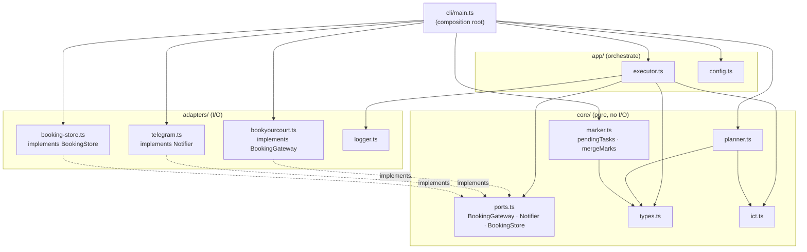
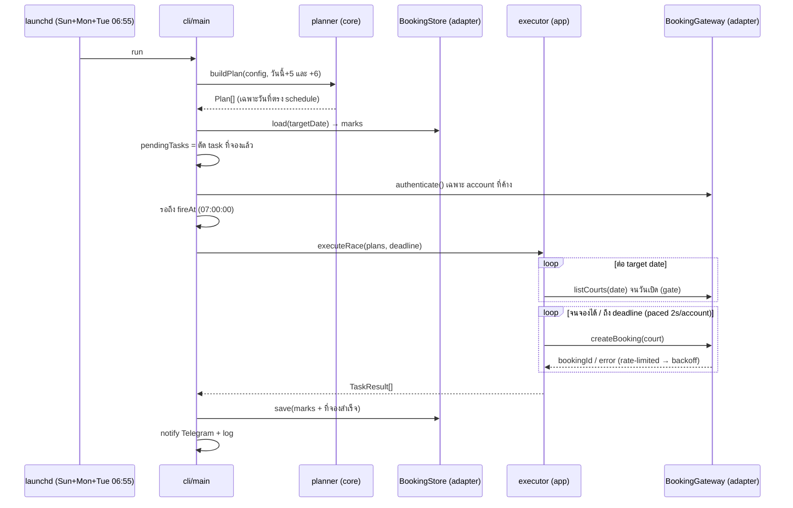

# botbookyoucourt

Bot จองสนามเทนนิส TU (bookyourcourt.psm.tu.ac.th) อัตโนมัติ — pure HTTP, ไม่ใช้ browser

## กติการะบบจอง

- จองล่วงหน้าได้ 6 วัน (target = today+6), slot วันใหม่เปิดทุกวัน 07:00 ICT
- 1 user จองได้ 1 ชั่วโมง/วัน → 2 ชม.ติดต้องใช้ 2 accounts
- court map: 01→39, 02→40, 03→41, 04→51, 05→52
- ⚠️ TU API บล็อก IP ต่างประเทศ → bot ต้องรันจาก **IP ไทย** เท่านั้น (ดู [docs/DEPLOYMENT.md](docs/DEPLOYMENT.md))

## Setup

```sh
bun install
cp .env.example .env   # กรอก credentials + telegram token + HEALTHCHECK_URL
```

`config.json` — วัน/เวลา/ลำดับ court ที่ต้องการ, เวลายิง (`race.fireAt`)

## คำสั่ง

```sh
bun run dry-run              # login + แสดง plan + ตาราง slot ว่าง (ไม่จองจริง)
bun run status               # ตาราง slot วันนี้
bun run status -- --date 2026-07-26
bun run run:now              # จองทันที ไม่รอ 07:00 (deadline 120s)
bun run run:scheduled        # โหมดจริง: รอถึง fireAt แล้วยิงจนถึง deadline
bun src/index.ts book --date 2026-07-22 --hour 10 --court 3   # จอง manual 1 slot
bun run cancel -- --account aof --code A0KK429
```

## Deployment

รันจริงบน Mac mini บ้าน (Thai IP) ด้วย launchd 2 agents — race (Sun,Mon,Tue 06:55) + fallback (Sun,Mon,Tue 07:10). setup ครั้งเดียว:

```sh
zsh scripts/setup-macmini.sh   # ลง bun, deps, pmset no-sleep, สร้าง+load launchd, smoke test
```

**Window:** เดิม slot เปิด 07:00 ICT ล่วงหน้า 6 วัน แต่ตั้งแต่ 2026-08 window ไม่แน่ชัด (หลักฐานชี้ว่าเหลือ +5) → bot จึง race ทุก candidate ใน `advanceDaysCandidates` (default `[5, 6]`) ที่ weekday ตรง `schedule` พร้อมกัน โดยมี **gate**: poll `listCourts` (read-only) จนวันเป้าหมายเปิดจริงค่อยยิงจอง. bot exit เองถ้าไม่มี candidate ไหนอยู่ใน config.

**Rate limit:** server มี anti-bot limit ("จองถี่เกินไป") → bot ยิงแบบ paced: `accountIntervalMs` 2s ต่อ account, `ipIntervalMs` 1s รวมทุก account, โดน limit เมื่อไหร่พักเพิ่ม `rateLimitBackoffMs` 5s.

runbook เต็ม (geo-block, healthchecks, troubleshooting, recovery) → [docs/DEPLOYMENT.md](docs/DEPLOYMENT.md)

## Logs

`logs/YYYY-MM-DD.log` + Telegram แจ้งผลทุกครั้ง (สำเร็จ/ล้มเหลว/crash)

## Architecture

Hexagonal-lite — แยกตาม role, dependency ไหลทางเดียว `cli → app → core`. รายละเอียด + กฎ dependency ดู [CONTRIBUTING.md](CONTRIBUTING.md).



Flow การจอง:


