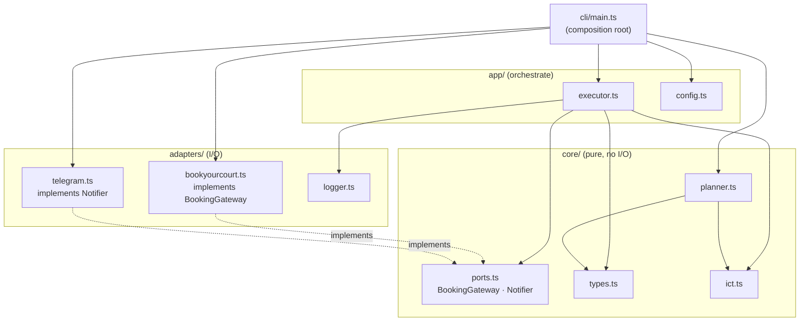
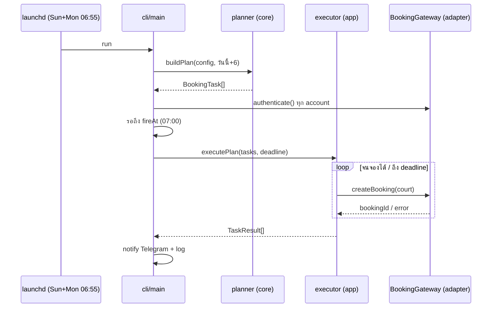

# botbookyoucourt

Bot จองสนามเทนนิส TU (bookyourcourt.psm.tu.ac.th) อัตโนมัติ — pure HTTP, ไม่ใช้ browser

## กติการะบบจอง

- จองล่วงหน้าได้ 7 วัน, slot วันใหม่เปิดทุกวัน 07:00 ICT
- 1 user จองได้ 1 ชั่วโมง/วัน → 2 ชม.ติดต้องใช้ 2 accounts
- court map: 01→39, 02→40, 03→41, 04→51, 05→52

## Setup

```sh
bun install
cp .env.example .env   # กรอก credentials + telegram token
```

`config.json` — วัน/เวลา/ลำดับ court ที่ต้องการ, เวลายิง (`race.fireAt`)

## คำสั่ง

```sh
bun run dry-run              # login + แสดง plan + ตาราง slot ว่าง (ไม่จองจริง)
bun run status               # ตาราง slot วันนี้
bun run status -- --date 2026-07-26
bun run run:now              # จองทันที ไม่รอ 07:00 (deadline 60s)
bun run run:scheduled        # โหมดจริง: รอถึง fireAt แล้วยิงจนถึง deadline
bun src/index.ts book --date 2026-07-22 --hour 10 --court 3   # จอง manual 1 slot
bun run cancel -- --account aof --code A0KK429
```

## ติดตั้ง scheduler (launchd, รัน Sun + Mon 06:55)

```sh
./scripts/install-launchd.sh
```

Script gen plist จาก path ปัจจุบัน แล้ว load ให้เลย — ย้าย repo ไป path อื่นก็รันซ้ำได้.

เครื่องต้องตื่นตอน 06:55 — ตั้ง wake schedule (Sun + Mon):

```sh
sudo pmset repeat wakeorpoweron MU 06:53:00
```

**Window:** slot เปิด 07:00 ICT สำหรับวัน **+6** (วันนี้จองล่วงหน้าได้ถึง today+6) → `buildPlan` default `advanceDays=6`. bot จะ exit เองถ้าวันเป้าหมาย (วันนี้+6) ไม่อยู่ใน config.

จองวันเล่นต้อง run ก่อน 6 วัน → คอร์ท **เสาร์ = run วันอาทิตย์**, คอร์ท **อาทิตย์ = run วันจันทร์** (จึงตั้ง launchd ไว้ Sun + Mon).

## Logs

`logs/YYYY-MM-DD.log` + Telegram แจ้งผลทุกครั้ง (สำเร็จ/ล้มเหลว/crash)

## Architecture

Hexagonal-lite — แยกตาม role, dependency ไหลทางเดียว `cli → app → core`. รายละเอียด + กฎ dependency ดู [CONTRIBUTING.md](CONTRIBUTING.md).



Flow การจอง:


